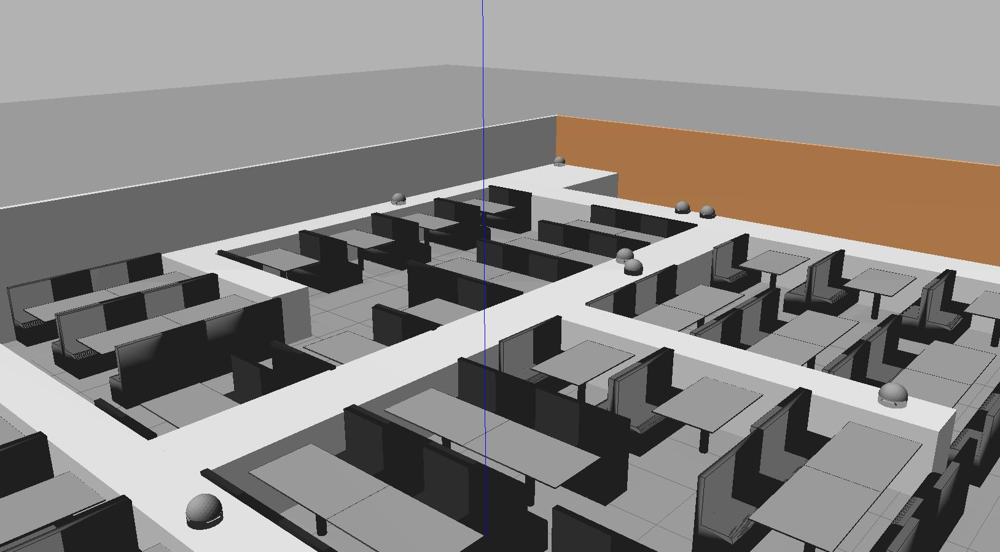

# Gazebo World Models
This repo contain a set of gazebo worlds created for simulation proposes. This worlds can be use to deploy robots for simulation, development and testing proposes.

## List of Worlds
Restaurant.world simulations of restaurant where robots travel on a dedicated high path.


## Installation
Worlds are intended to be use in gazebo, so you need to have an working gazebo enviropment.
For running the restaurant world inside gazebo:
download the repo
```
git clone https://github.com/milekium/Gazebo-Worlds.git
cd Gazebo-Worlds
```
You need to set your enviropment variables to your local path, so edit the env.sh file to your absolute path, after that: 
```
source env.sh
gazebo world/restaurant.world
```

## Usage: 
This repo is intended as a way to develop and create/modify worlds, not to run actual simulations of the robots. 
Gazebo is a simulation enviropment for robots, so for use of the world and simulation you need to deploy a robot and run a robot operation system, like ROS. This repo only contain the world building, world models and robot models, but robots are just models no any working robot simulation. 

## Contributing: 
If you want to include more worlds of modify existings ones, you are wellcome.

## Credits: 
author: milekium

## License: 
Same license used by Ros.
### GNU LGPL v3
[](https://www.gnu.org/licenses/lgpl-3.0)  
`[](https://www.gnu.org/licenses/lgpl-3.0)`
